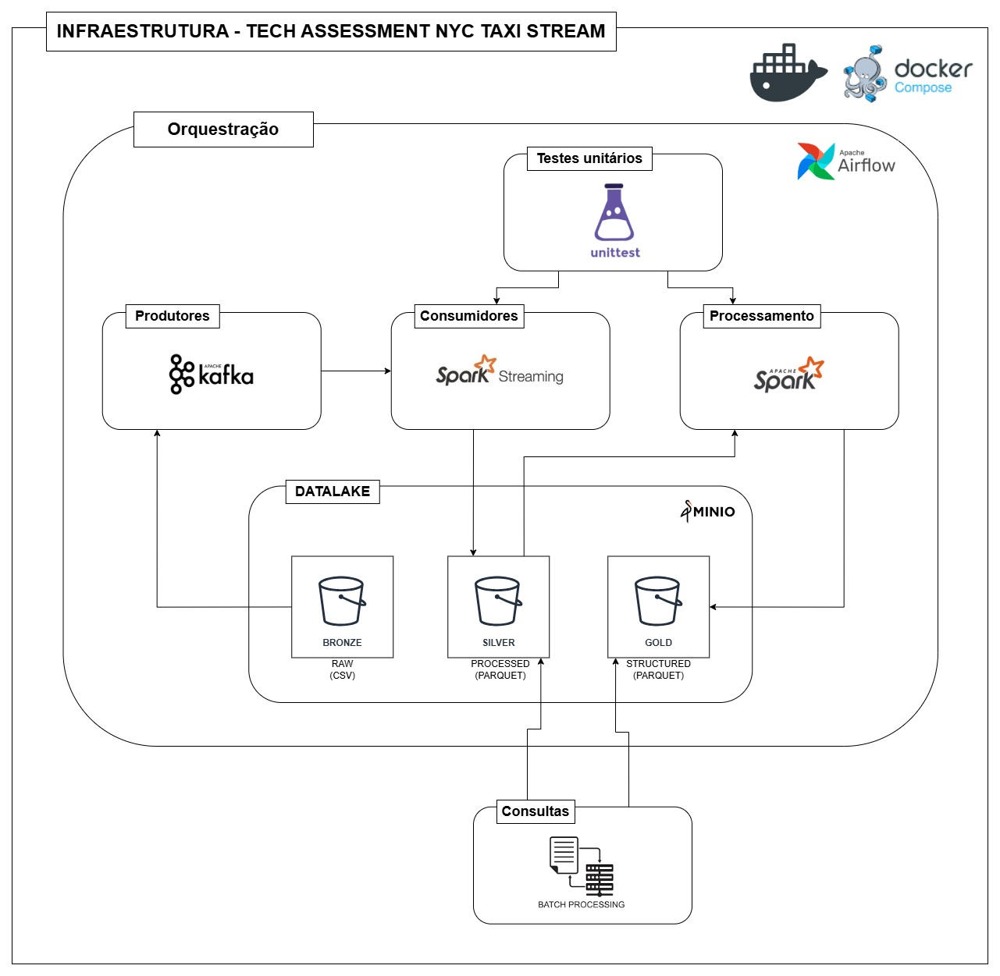

# TECH ASSESSMENT - NYC TAXI FARE PREDICTION STREAM


## ESCOPO
* Criação de aplicação **streaming** para **produção de eventos** baseados no dataset `train.csv`, disponível em [New York City Fare Prediction | KAGGLE](https://www.kaggle.com/competitions/new-york-city-taxi-fare-prediction/overview);

* Utilização de aplicação para **consumo dos eventos**, com a possibilidade de filtros por data e local da corrida;

* Estruturação de um **Datalake** para consolidar os dados analíticos por data/horário da corrida (ou local) e posteriormente **consultar** as informações coletadas de forma **batch** e/ou **NRT**;

* Armazenamento dos resultados em formato **parquet** e/ou **delta lake**.


### Pontos considerados relevantes do desafio
* Incluir testes unitários;

* Realizar desenho da solução;

* Estrutura do código / Boas práticas;

* Aplicação up and running.

>**Importante**  
>O exercício tem como foco a **estruturação**, **organização** e **apresentação da solução**.  
>E, devido a limitações de hardware e recursos, alguns componentes não puderam ser totalmente testados, mas o fluxo foi projetado para garantir a viabilidade da solução.


## PLANEJAMENTO
### *Definição da arquitetura e configuração do ambiente*
* Definir fluxo de dados;

* Realizar análise exploratória;

* Definir ferramentas utilizadas;

* Criar ambiente com Docker Compose;

* Preparar esquema de eventos para streaming.

### *Produção e consumo de eventos*
#### *Produção*
* Criar aplicação para realizar leitura do dataset e publicação dos eventos;

* Estruturar eventos em JSON com campos essenciais;

* Definir testes para validar publicação dos eventos.

#### *Consumo*
* Criar consumidor que lê os eventos streaming;

* Implementar filtros por data/local da corrida;

* Escrita dos dados em parquet/delta lake;

* Definir testes para validar consumo dos eventos.

### *Estruturação do Datalake e Processamento*
* Definir local de armazenamento;

* Organizar estrutura do Datalake;

* Criar consultas batch/NRT para validar a estrutura;

* Testar leitura e agregações básicas;

* Definir testes de validação dos dados (considerar normalização).

### *Orquestração*
* Criar DAGs para automatizar produção, consumo e processamento;

* Ajustar conexões.


## DESENVOLVIMENTO

A arquitetura proposta para a solução pode ser visualizada logo abaixo:



### *Infraestrutura*
Pensando na utilização dos serviços de forma padronizada (quanto às versões, por exemplo) e garantindo a replicação do ambiente, foi definido o Docker e Docker Compose para realização do deploy de cada serviço.

### *Streaming*
#### *Producers*
Foram implementadas duas possibilidades para a solução de produção e consumo dos eventos, a primeira abordagem sendo mais complexa e escalável com Kafka, enquanto a segunda foi utilizando a recomendação com o Flask-SSE, pela facilitação na implementação.

Durante a configuração do Kafka foram enfrentados erros relacionados ao LISTENER e a comunicação com a porta 9092, no momento de criação do tópico.

Na segunda abordagem, no entanto, foram encontrados problemas com limitação de hardware/memória no momento de mapeamento do volume do que seriam os dados brutos (`train.csv`), durante os testes com Flask-SSE.

#### *Consumers*
Buscando simplicidade na implementação do consumidor de eventos e nas pipelines de processamento, houve foco na utilização de Python, além de combinar com o PySpark para o processamento dos dados de forma eficiente, devido familiaridade com a ferramenta e também pela sua escalabilidade em grande volume de dados.

#### *Datalake*
A estruturação do Datalake foi realizada por meio do MinIO, pensando em uma alternativa leve e compatível com S3 (focando no ambiente da AWS).

Além disso, a organização do Datalake foi composta seguindo o modelo Arquitetura do Medalhão, onde os dados são distribuídos nas camadas Bronze, Prata e Ouro, seguindo uma esteira iniciando na ingestão bruta dos dados, limpeza e padronização dos dados e, por fim, a modelagem dimensional e agregação, respectivamente.

#### *Orquestração*
Para realizar o gerenciamento das pipelines, refletindo sua comum utilização no mercado e valorizando novamente a escalabilidade, foi utilizado o Airflow.


### EXECUÇÃO DO PROJETO
> Obs.: Como já mencionado, algumas etapas não puderam ser completamente testadas. No entanto, a estrutura foi montada para garantir um fluxo funcional, bastando ajustes de ambiente e possíveis pequenas adequações posteriores para uma execução completa.

#### *1. Pré-requisitos*
* Docker e Docker Compose instalados.
* (Opcional) Python 3.8+ para execução dos scripts sem Docker.

#### *2. Clonar o repositório*
```
git clone https://github.com/giovanna-matoss/tech-assessment-nyctaxi.git
cd tech-assessment-nyctaxi
```

#### *3. Subir o ambiente*
Disponível no `Makefile`, pode ser executado o comando abaixo:

```
make up-infra
```

Além disso, podem ser executados outros comandos utilizando o Makefile para disponibilização do ambiente, recomenda-se a consulta.

### PRÓXIMOS PASSOS E MELHORIAS
#### *1. Correção dos problemas com Kafka e/ou Flask-SSE*
* Investigar possibilidade de liberar acesso ao IP em específico utilizado pelo Kafka;
* Alterar de forma balanceada a alocação de recursos de hardware pelo Flask-SSE e demais serviços que utilizam muita memória, principalmente.

#### *2. Melhorias no processamento e consultas*
* Otimização na ingestão no MinIO para melhorar eficiência;
* Criação de consultas analíticas com o PySpark.

#### *3. Testes e validação final*
* Executar o fluxo completo em um ambiente com melhor capacidade;
* Possivelmente ajustar pipelines do Airflow conforme testes e mapeamento de necessidade.